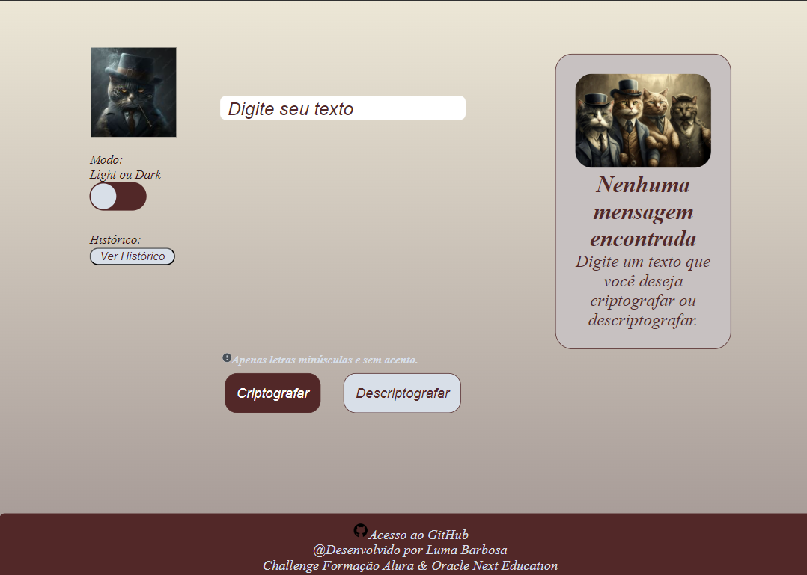
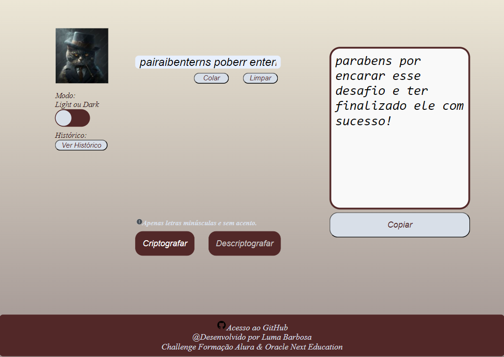
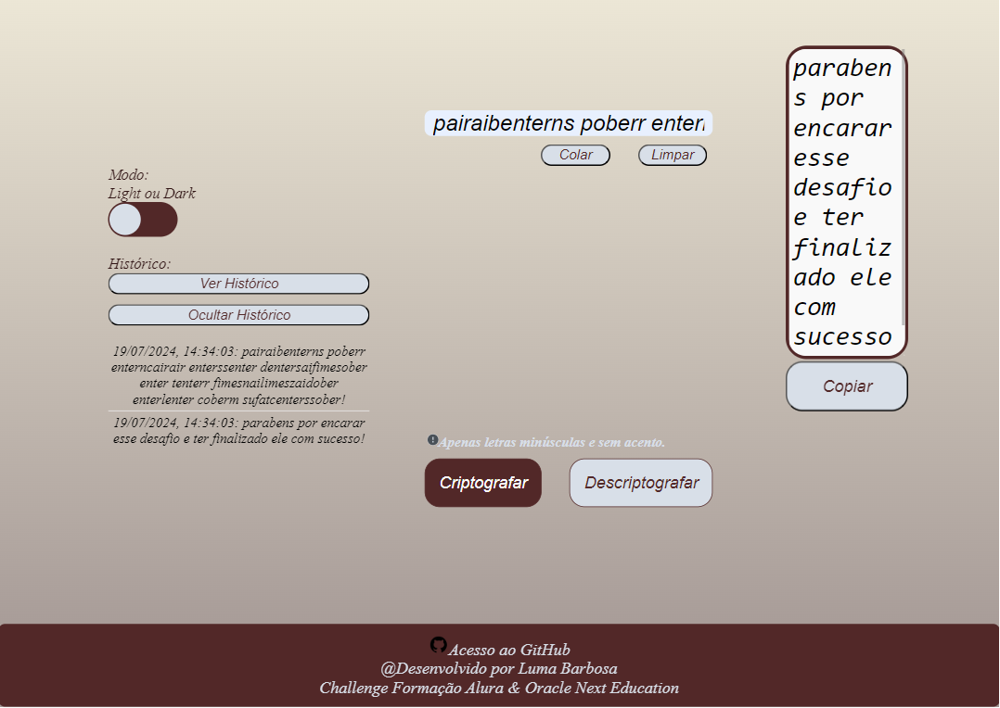
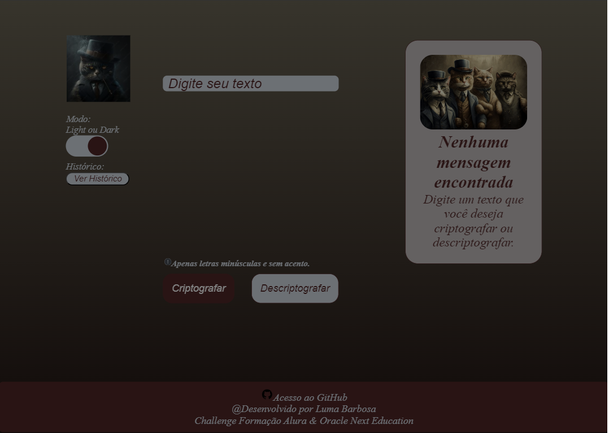

readme

# Projeto: Página de Criptografia e Descriptografia de Texto

## Descrição

Este projeto é uma página web desenvolvida utilizando 'html5', CSS e JavaScript. A página permite que o usuário insira um texto e realize a criptografia e/ou descriptografia do mesmo. Além disso, oferece funcionalidades adicionais como copiar, colar e limpar o texto, além de um histórico de criptografias/descriptografias realizadas e um design responsivo.

## Funcionalidades

- **Criptografia de Texto:** Permite ao utilizador cifrar o texto introduzido.
- **Descriptografia de Texto:** Permite ao utilizador decifrar o texto introduzido.
- **Alteração de Tela:** Alternar entre a tela inicial com imagem e a tela com resultados em texto e botões de ação.
- **Copiar Texto:** Permite ao utilizador copiar o texto cifrado/decifrado para a área de transferência.
- **Colar Texto:** Permite ao utilizador colar texto da área de transferência no campo de entrada.
- **Limpar Texto:** Limpa o campo de entrada e a área de resultado.
- **Histórico de Criptografias/Descriptografias:** Mostra um histórico das operações realizadas, acessível através de um botão de 'Histórico'.

## Tecnologias Utilizadas

### HTML

A estrutura básica da página é construída em HTML. Os principais elementos incluem:
- Campos de entrada para o texto.
- Botões para realizar as ações (criptografar, descriptografar, copiar, colar, limpar e ver histórico).
- Contêineres para exibir resultados e histórico.

### CSS

A estilização da página é feita com CSS. As principais características incluem:
- **Layout Flexível:** Uso de Flexbox para alinhar e distribuir os elementos na página.
- **Temas:** Implementação de temas claros e escuros alternáveis através de classes CSS.
- **Responsividade:** Estilização adaptável a diferentes tamanhos de tela.
- **Estética:** Uso de cores, fontes e bordas para criar um visual agradável.

### JavaScript

A lógica de negócios é implementada em JavaScript. As principais funções incluem:
- **Manipulação de DOM:** Interação com os elementos da página para exibir resultados e histórico.
- **Armazenamento Local:** Uso do `localStorage` para armazenar e recuperar o histórico de operações.
- **Eventos:** Manipulação de eventos de clique e carregamento da página para realizar ações como criptografar, descriptografar, copiar, colar, limpar e exibir o histórico.

### Como Executar

1. **Clone o repositório:** https://github.com/Lumabarbosa/DecodificadorDeTexto_Oracle_Alura.git
2. **Navegue até o diretório do projeto:** cd decodificador-de-texto-Oracle-Alura
3. **Abra o arquivo index.html no seu navegador preferido.**

### Contribuições

Contribuições são bem-vindas! Sinta-se à vontade para abrir issues e pull requests para melhorias ou correções.

### Licença

Este projeto está licenciado sob a MIT License.

### Layout's da página

- **Página Inicial**

- **Página Criptografia/Descriptografia**

- **Histórico exibido**

- **Modo Dark**

Feito com ❤️ por Luma Barbosa.
